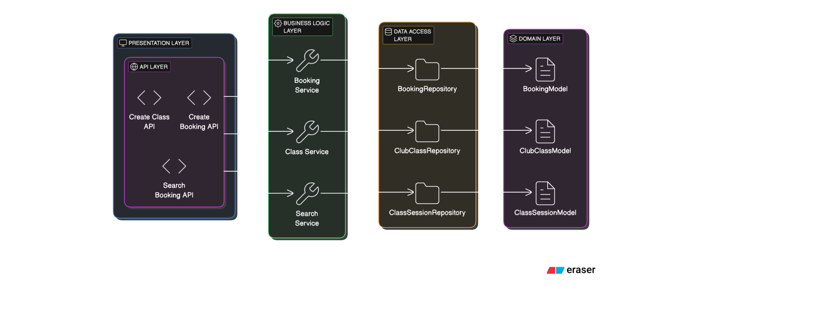

# Club Class Booking System

## Overview

This is a Restful API project designed to allow a club owner to manage class bookings. It includes the following features:

1. **Create a Class**: A club owner can create classes with the necessary details (name, start date, end date, start time, duration, and capacity).
2. **Book a Class**: A member can book a spot in a class as long as it does not exceed the class's capacity.
3. **Search Bookings**: A club owner can search for bookings by member name and/or date range.

## Architecture
The system follows a **Layered Architecture** commonly used in Spring Boot applications. This architecture is designed to separate concerns and ensure that each part of the application is modular and can be independently maintained and tested. Here's an overview of the architecture layers:

### 1. **Controller Layer**:
- This layer is responsible for handling HTTP requests and responses. It contains the RESTful API endpoints. For example, `ClubClassController` handles the creation of classes and the booking process.

### 2. **Service Layer**:
- The service layer contains the business logic of the application. It handles the creation of classes, booking of classes, and searching of bookings. For example, the `ClubClassService` contains the logic for checking class availability and booking spots for members.

### 3. **Model Layer**:
- This layer contains the data models or entities, such as `Booking`, `ClubClass`, and any other data structures that represent the application's core business objects.

### 4. **Repository Layer** :
- This layer interacts with the data source. It performs operations like saving, updating, and retrieving data from the database. In the current in-memory version, this layer is not used.

### 5. **DTO Layer**:
- Data Transfer Objects (DTOs) are used to transfer data between layers. These objects define the shape of the data being sent in API requests and responses.

### Architecture Diagram:

The following architecture diagram illustrates the flow and relationship between different layers:



## Technologies Used

- **Spring Boot**: To build the REST API.
- **Gradle**: Build tool to manage dependencies and compile the project.
- **JUnit 5**: For unit testing of service and controller layers.
- **Mockito**: To mock dependencies during unit testing.
- **H2 Database**: In-memory database used to store class and booking information (optional based on implementation).

## How to Run the Project in IntelliJ IDEA

### Prerequisites:

- JDK 11 or higher installed on your machine.
- IntelliJ IDEA or any Java IDE that supports Gradle projects.

### Steps:

1. **Clone the Repository**:
   Clone the repository to your local machine using the following command:

   ```bash
   git clone https://github.com/krutikanagar/ClubManagerApplication.git

2. **Import the Project into IntelliJ IDEA**:
- Open **IntelliJ IDEA**.
- Go to `File` > `Open`.
- Select the folder where you cloned the repository.
- IntelliJ IDEA will automatically detect that this is a **Gradle project** and will offer to import the necessary dependencies.

3. **Build the Project**:
   Once the project is opened in IntelliJ, build it using the following Gradle command:

    ```bash
    ./gradlew build

Alternatively, you can use the **Gradle tool window** in IntelliJ to run the build tasks.


4. **Run the Application**:
   To run the Spring Boot application:
- Right-click on the main class (e.g., `ClubClassBookingApplication.java`) and click `Run`.
- Alternatively, run the following command from the terminal:

    ```bash
  ./gradlew bootRun

5. **Access the API**:
   The API will be available at: http://localhost:8080

6. **Access the In memory database**: http://localhost:8080/h2-console
    
## API Endpoints

### 1. **Create a Class** (`POST /api/classes`)

- **Description**: Create a class with the given details (e.g., name, start date, end date, start time, duration, capacity).
- **Sample Request**:
`  curl -X POST http://localhost:8080/api/classes/create \
 -H "Content-Type: application/json" \
 -d '{
     "name": "Pilates",
     "startDate": "2025-03-01",
     "endDate": "2025-03-10",
     "startTime": "10:00",
     "duration": 60,
     "capacity": 20
 }'
`

- **Request Body**:
 ```json
 {
   "name": "Pilates",
   "startDate": "2025-03-01",
   "endDate": "2025-03-10",
   "startTime": "14:00",
   "duration": 60,
   "capacity": 10
 }
 ```
- **Response**:
 ```json
 {
   "status": "success",
   "message": "Class Pilates created successfully."
 }
 ```

### 2. **Book a Class** (`POST /api/bookings`)

- **Description**: Book a spot in a class for a member. The class cannot exceed its capacity.
- **Sample Request**:
`curl -X POST http://localhost:8080/api/bookings/create -H "Content-Type: application/json"      -d '{
           "memberName": "John Doe",
           "className": "Pilates",
           "participationDate": "2025-03-03"
         }'
`


- **Request Body**:
 ```json
 {
   "memberName": "John Doe",
   "className": "Pilates",
   "participationDate": "2025-03-03"
 }
 ```
- **Response**:
 ```json
 {
   "status": "success",
   "message": "Member John Doe booked for Pilates class successfully."
 }
 ```

### 3. **Search Bookings** (`GET /api/bookings/search`)

- **Description**: Search for bookings by member name, participation date, or a date range.
- **Query Parameters**:
- `memberName` (optional) - The name of the member.
- `startDate` (optional) - The start date for the booking search (format: `YYYY-MM-DD`).
- `endDate` (optional) - The end date for the booking search (format: `YYYY-MM-DD`).


- **Sample Request**:
```
curl -X GET "http://localhost:8080/api/bookings/search?memberName=John%20doef&startDate=2025-01-01" -H "Content-Type: application/json"
```

- **Response**:
  ```json
  [
    {
      "className": "Pilates",
      "memberName": "John Doe",
      "participationDate": "2025-03-03"
    }
  ]
  ```

## Validation and Constraints

- **Start Date**: The start date must be in the future.
- **End Date**: The end date must be in the future and after the start date.
- **Capacity**: The capacity of the class must be at least 1.
- **Booking**: Bookings are subject to class capacity. A member can book multiple classes on the same day and time, but no class should exceed its capacity.

**Validation Annotations Used**:
- `@NotNull`: Ensures that a field is not null.
- `@Future`: Ensures that a date is in the future.
- `@NotBlank`: Ensures that a string is not null or empty.


## Assumptions
**Class name need not be unique**:
Currently the system does not  allow creating class with the same name if the start/end dates overlap at all.

For example, if a class named Pilates starts on December 1st and ends on December
20th , we do not allow class creation on available dates between overlapping period at this time.

Therefore, creation of another class with same name, Pilates from Dec 15th to Dec 31st is not allowed since they have overlapping periods from 15th to 20th Dec.
We can enhance this in the future to allow for class creation on available dates i.e. 21st Dec to 31st Dec.

## Testing

- **Service Layer Tests**: Unit tests for the core business logic, ensuring the correct behavior of methods like class creation and booking.
- **Controller Tests**: API endpoints are tested using **MockMvc** to simulate HTTP requests and validate responses.
- **Validation Tests**: Unit tests ensure that the validation logic (e.g., for dates and capacity) is functioning as expected.

To run the tests:

1. **In IntelliJ IDEA**:
- Right-click on the test class or method and select `Run`.

2. **Via Gradle**:
   Run the following command to execute all tests:

  ```
  ./gradlew test
  ```

## Project Structure

- **`src/main/java`**: Contains the main code for the Spring Boot application.
- **`controller`**: Contains the API controllers (handling HTTP requests).
- **`service`**: Contains business logic for creating classes, booking, and searching bookings.
- **`repository`**: Contains code for interacting with the database (or in-memory storage).
- **`model`**: Contains the data models (e.g., `BookingModel`, `ClubClassModel`).
- **`dto`**: Data Transfer Objects used for request/response bodies.
- **`utilities`**: Contains Exception Handling, API response utility.
- **`src/test/java`**: Contains the test classes.
- **`controller`**: Contains tests for the API endpoints.
- **`service`**: Contains tests for the service layer.

## Future Improvements

- **Enhance Functionality**: Add modify/delete feature for classes/bookings, enhance search on complex patterns
- **Database Integration**: Integrate with a relational database (e.g., MySQL or PostgreSQL) for data persistence.
- **Authentication and Authorization**: Implement user authentication and authorization for accessing the APIs.
- **Pagination and Sorting**: Add support for pagination and sorting in the search bookings API to handle large datasets.
- **Error Handling**: Improve global exception handling with more detailed error messages for edge cases.
- **UI Integration**: Add UI support for visualization

## Conclusion

This project implements a simple and efficient booking system for a club with a focus on maintaining clean architecture and code quality. It provides APIs to create classes, book them, and search for bookings, with validation in place to ensure data integrity.
